# 28 - Fluxograma Completo do Cliente - Leva+

**Data:** 2026-05-26  
**Escopo:** Fluxo completo do cliente desde o boot até a finalização de corridas/entregas  
**Inclui:** Diagramas de sequência, payloads de API, estados e transições

---

## 📋 Índice

1. [Visão Geral do Fluxo](#visao-geral)
2. [Diagrama de Boot e Autenticação](#boot-flow)
3. [Fluxo de Corrida (Ride)](#ride-flow)
4. [Fluxo de Entrega (Delivery)](#delivery-flow)
5. [Diagrama de Estados da Corrida](#ride-states)
6. [Payloads de API](#api-payloads)
7. [Eventos WebSocket](#websocket-events)
8. [Hooks e Monitoramento](#hooks-monitoring)

---

## 1. Visão Geral do Fluxo <a name="visao-geral"></a>

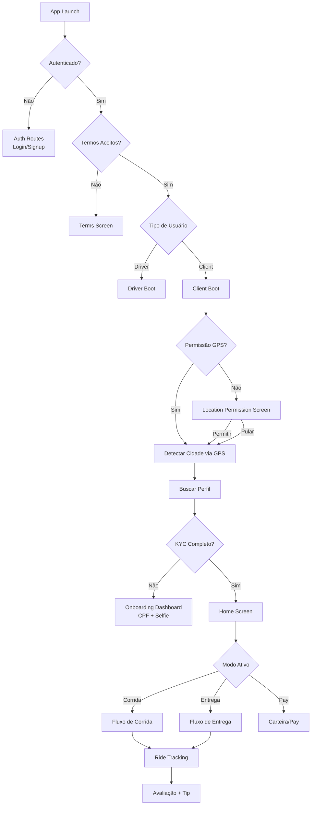

---

## 2. Diagrama de Boot e Autenticação <a name="boot-flow"></a>

### 2.1 Sequência de Boot do Cliente

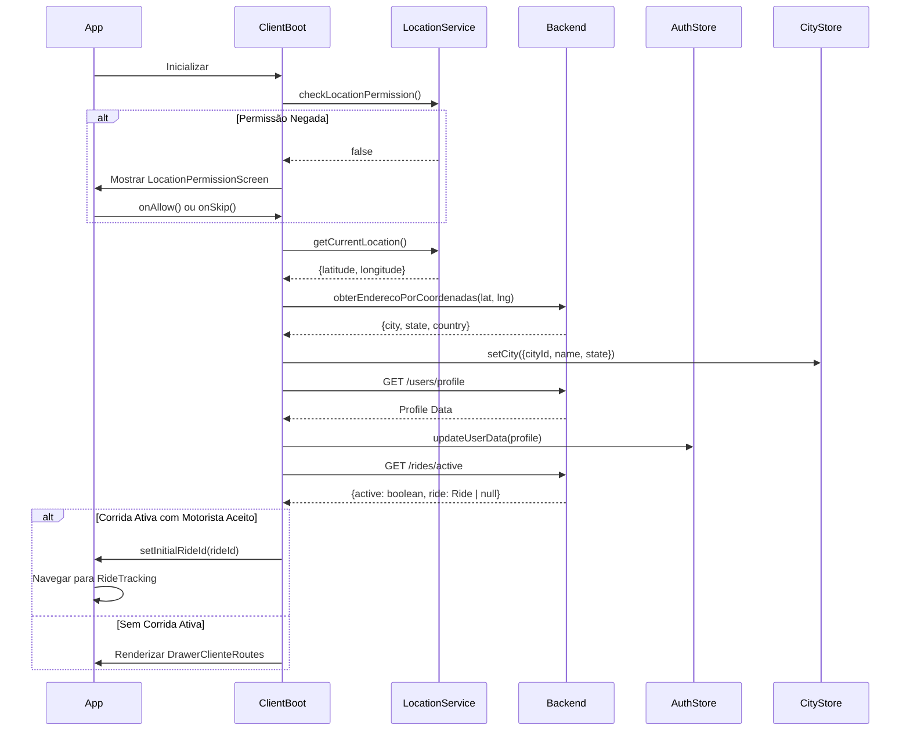

### 2.2 Validação KYC (Know Your Customer)

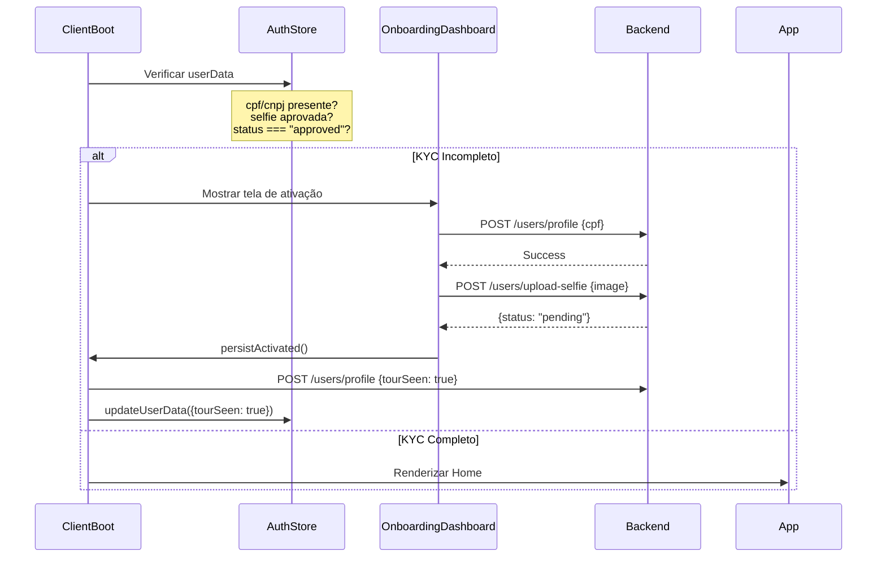

---

## 3. Fluxo de Corrida (Ride) <a name="ride-flow"></a>

### 3.1 Fluxo Completo de Solicitação de Corrida

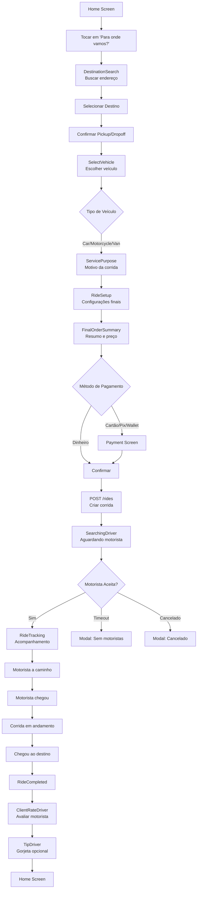

### 3.2 Fluxo com Negociação (Ofertas)

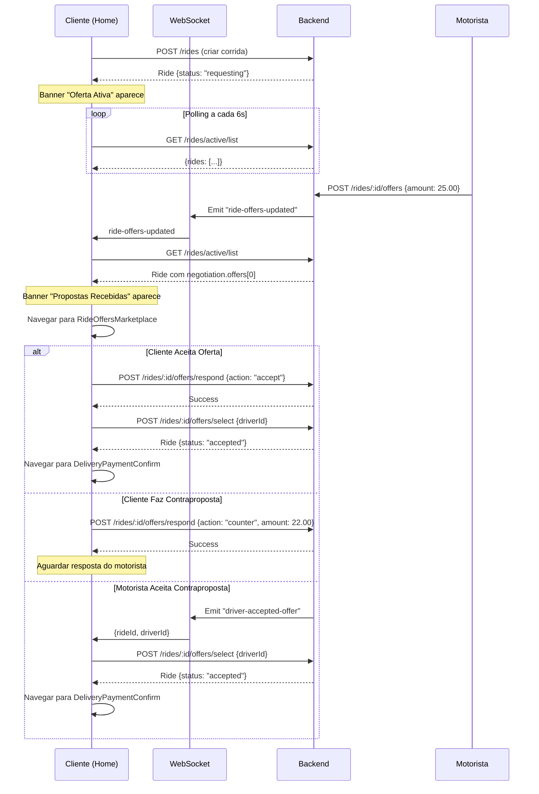

### 3.3 Fluxo de Cancelamento

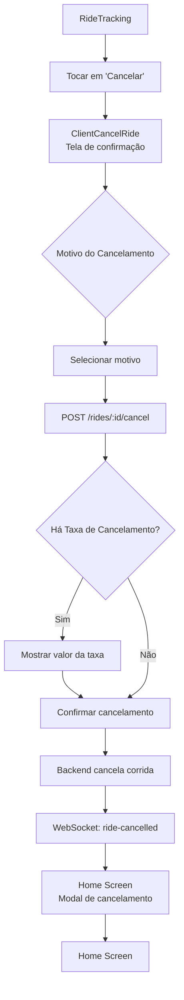

---

## 4. Fluxo de Entrega (Delivery) <a name="delivery-flow"></a>

### 4.1 Fluxo Completo de Solicitação de Entrega

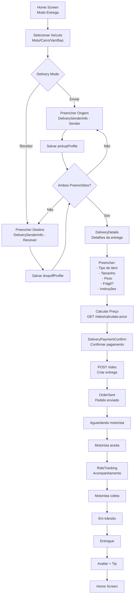

### 4.2 Payload de Entrega (DeliveryAddressProfile)

```typescript
// Tipo usado em pickupProfile e dropoffProfile
interface DeliveryAddressProfile {
  address: string;           // Endereço completo formatado
  addressCoords: {           // Coordenadas do endereço
    latitude: number;
    longitude: number;
  } | null;
  details?: string;          // Complemento (apto, bloco, etc)
  contactName: string;       // Nome do contato no local
  contactPhone: string;      // Telefone do contato
}
```

### 4.3 Navegação entre Telas de Entrega

```mermaid
sequenceDiagram
    participant Home
    participant SenderInfo as DeliverySenderInfo
    participant Details as DeliveryDetails
    participant Payment as DeliveryPaymentConfirm
    participant OrderSent

    Home->>SenderInfo: navigate({mode: "sender", vehicleType: "motorcycle"})
    Note over SenderInfo: Usuário preenche:<br/>- Endereço<br/>- Nome do contato<br/>- Telefone<br/>- Complemento
    
    SenderInfo->>Home: setParams({deliveryDraftProfile})
    Note over Home: pickupProfile = {<br/>  address: "Rua X, 123",<br/>  contactName: "João",<br/>  contactPhone: "11999999999",<br/>  details: "Apto 42"<br/>}
    
    Home->>SenderInfo: navigate({mode: "receiver", vehicleType: "motorcycle"})
    Note over SenderInfo: Usuário preenche dados do destinatário
    
    SenderInfo->>Home: setParams({deliveryDraftProfile})
    Note over Home: dropoffProfile = {<br/>  address: "Av Y, 456",<br/>  contactName: "Pedro",<br/>  contactPhone: "11888888888"<br/>}
    
    Home->>Details: navigate({pickupProfile, dropoffProfile, vehicleType})
    Note over Details: Usuário preenche:<br/>- Tipo de item<br/>- Tamanho<br/>- Peso<br/>- Frágil<br/>- Instruções
    
    Details->>Backend: POST /rides/calculate-price
    Backend-->>Details: {pricing, distance, duration}
    
    Details->>Payment: navigate({pricing, pickup, dropoff, details})
    Payment->>Backend: POST /rides (create delivery)
    Backend-->>Payment: Ride {_id, status: "requesting"}
    
    Payment->>OrderSent: navigate({rideId})
    Note over OrderSent: Aguardando motorista aceitar
```

---

## 5. Diagrama de Estados da Corrida <a name="ride-states"></a>

### 5.1 Máquina de Estados da Corrida

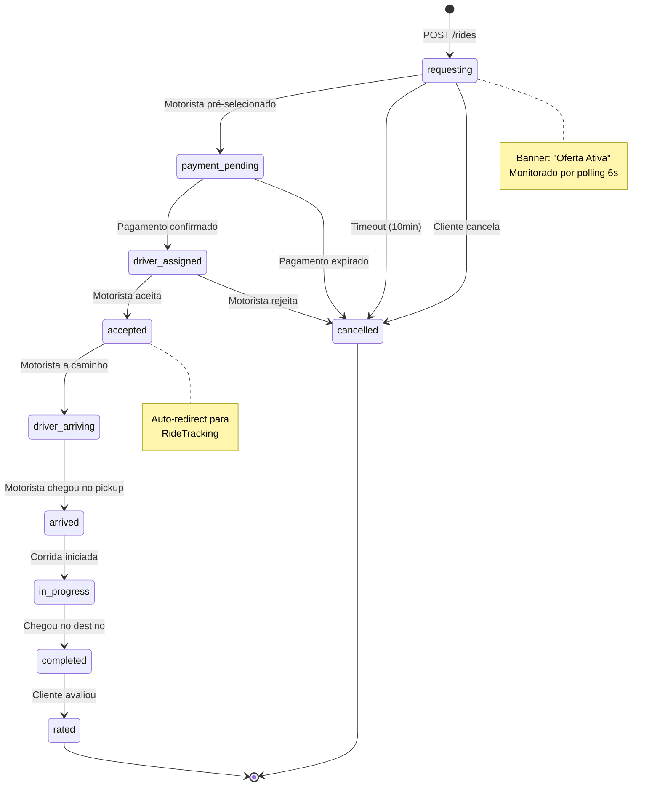

### 5.2 Estados com Negociação

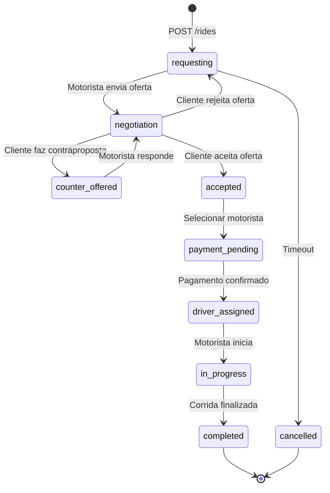

### 5.3 Tabela de Status e Ações

| Status | Descrição | Ação do Cliente | Banner/Monitoramento |
|--------|-----------|-----------------|----------------------|
| `requesting` | Aguardando motorista | Aguardar | Banner "Oferta Ativa" |
| `payment_pending` | Pagamento pendente | Confirmar pagamento | Auto-redirect |
| `driver_assigned` | Motorista designado | Aguardar aceite | - |
| `accepted` | Motorista aceitou | Aguardar chegada | Auto-redirect para RideTracking |
| `driver_arriving` | Motorista a caminho | Aguardar | RideTracking |
| `arrived` | Motorista chegou | Entrar no veículo | RideTracking |
| `in_progress` | Corrida em andamento | Aguardar destino | RideTracking |
| `completed` | Corrida finalizada | Avaliar motorista | Navigate para RateDriver |
| `cancelled` | Corrida cancelada | Ver modal | Modal "Pedido Expirado" |
| `negotiation` | Em negociação | Aceitar/Contrapor | Banner "Propostas Recebidas" |

---

## 6. Payloads de API <a name="api-payloads"></a>

### 6.1 Criar Corrida/Entrega

**Endpoint:** `POST /rides`

```typescript
interface CreateRideRequest {
  serviceType: "ride" | "delivery";
  vehicleType: "motorcycle" | "car" | "van" | "truck";
  
  // Localização
  pickup: {
    address: string;
    latitude: number;
    longitude: number;
  };
  dropoff: {
    address: string;
    latitude: number;
    longitude: number;
  };
  stops?: Location[];  // Paradas intermediárias
  
  // Preços calculados
  pricing: {
    basePrice: number;
    distancePrice: number;
    serviceFee: number;
    total: number;
    subtotal?: number;
    discountAmount?: number;
    promotionCode?: string;
    currency: string;
    platformFee?: number;
    driverValue?: number;
  };
  
  // Distância e duração
  distance: {
    value: number;  // metros
    text: string;   // "5.2 km"
  };
  duration: {
    value: number;  // segundos
    text: string;   // "15 min"
  };
  
  // Rota
  routeCoordinates?: Array<{
    latitude: number;
    longitude: number;
  }>;
  
  // Detalhes específicos
  details?: {
    itemType?: string;           // "document", "package", "food"
    needsHelper?: boolean;       // Precisa de ajudante?
    insurance?: "none" | "basic" | "standard" | "premium";
    priority?: number;           // 1-5
    cargoSize?: "small" | "medium" | "large";
    approximateWeightKg?: number;
    isFragile?: boolean;
    pickupComplement?: string;   // "Apto 42, bloco B"
    dropoffComplement?: string;
    recipientName?: string;      // Para entregas
    recipientPhone?: string;     // Para entregas
    recipientInstructions?: string;
    pickupPin?: string;          // PIN de coleta
    deliveryPin?: string;        // PIN de entrega
    specialInstructions?: string;
  };
  
  // Pagamento
  payment?: {
    method?: {
      type?: "credit_card" | "pix" | "cash";
    };
  };
  
  // Agendamento
  scheduledFor?: string;  // ISO 8601: "2026-05-27T14:00:00Z"
  
  // Negociação
  negotiation?: {
    enabled?: boolean;
    clientOffer?: number;
  };
  
  // Promoção
  promotionCode?: string;
}
```

**Resposta:** `Ride` (objeto completo da corrida)

### 6.2 Calcular Preço

**Endpoint:** `POST /rides/calculate-price`

```typescript
interface CalculatePriceRequest {
  pickup: {
    address: string;
    latitude: number;
    longitude: number;
  };
  dropoff: {
    address: string;
    latitude: number;
    longitude: number;
  };
  stops?: Location[];
  vehicleType: "motorcycle" | "car" | "van" | "truck";
  
  // Extensões logísticas
  serviceType?: "ride" | "delivery";
  deliveryType?: string;
  cargoSize?: string;
  priority?: number;
  needsHelper?: boolean;
  isFragile?: boolean;
  approximateWeightKg?: number;
  
  // Métricas pré-calculadas (do Google Maps)
  distance?: number;  // metros
  duration?: number;  // segundos
}
```

**Resposta:**

```typescript
interface CalculatePriceResponse {
  pricing: {
    basePrice: number;
    distancePrice: number;
    serviceFee: number;
    total: number;
    subtotal?: number;
    discountAmount?: number;
    promotionCode?: string;
    currency: string;
    platformFee?: number;
    driverValue?: number;
  };
  distance: {
    value: number;
    text: string;
  };
  duration: {
    value: number;
    text: string;
  };
  smartPricing?: {
    minimumPrice: number;
    suggestedPrice: number;
    priorityPrice: number;
    distanceKm: number;
    demandLevel: string;
    deliveryScore: number;
  };
}
```

### 6.3 Buscar Motoristas Próximos

**Endpoint:** `GET /rides/nearby-drivers`

**Query Params:**
```typescript
{
  latitude: number;
  longitude: number;
  radius: number;  // metros (padrão: 5000)
}
```

**Resposta:**

```typescript
Array<{
  id: string;
  name?: string;
  profilePhoto?: string | null;
  rating?: number;
  latitude: number;
  longitude: number;
  type: "motorcycle" | "car" | "van" | "truck";
  rotation: number;
  serviceTypes?: string[];  // ["ride", "delivery"]
}>
```

### 6.4 Listar Corridas Ativas

**Endpoint:** `GET /rides/active/list`

**Resposta:**

```typescript
interface ActiveRidesResponse {
  active: boolean;
  count: number;
  rides: Ride[];
}

interface Ride {
  _id: string;
  clientId: any;
  driverId?: any;
  serviceType: string;
  vehicleType: string;
  pickup: Location;
  dropoff: Location;
  pricing: PricingCalculation;
  distance: DistanceDuration;
  duration: DistanceDuration;
  routeCoordinates?: RouteCoordinate[];
  details?: RideDetails;
  status: string;
  cancellationFee?: number;
  requestedAt: string;
  acceptedAt?: string;
  arrivedAt?: string;
  startedAt?: string;
  completedAt?: string;
  cancelledAt?: string;
  scheduledFor?: string;
  
  negotiation?: {
    enabled?: boolean;
    clientOffer?: number | null;
    suggestedMinPrice?: number | null;
    finalAgreedPrice?: number | null;
    selectedDriverId?: string | null;
    offers?: RideOffer[];
  };
  
  promotion?: {
    promotionId?: string;
    code?: string;
    discountType?: "fixed" | "percentage";
    discountValue?: number;
    discountAmount?: number;
    appliedAt?: string;
  };
  
  payment?: {
    method?: {
      type?: string;
    };
  };
  
  isWaitingInQueue?: boolean;
  arrivedAtDropoff?: boolean;
  createdAt: string;
  updatedAt: string;
}

interface RideOffer {
  driverId: string | { _id: string; name?: string; profilePhoto?: string };
  amount: number;
  status: "accepted" | "countered" | "rejected" | "client_countered";
  message?: string;
  createdAt?: string;
  updatedAt?: string;
}
```

### 6.5 Responder a Oferta

**Endpoint:** `POST /rides/:rideId/offers/respond`

```typescript
{
  action: "accept" | "counter" | "reject";
  amount?: number;      // Obrigatório se action === "counter"
  message?: string;     // Mensagem opcional para o motorista
}
```

### 6.6 Selecionar Motorista (Após Aceitar Oferta)

**Endpoint:** `POST /rides/:rideId/offers/select`

```typescript
{
  driverId: string;  // ID do motorista selecionado
}
```

### 6.7 Cancelar Corrida

**Endpoint:** `POST /rides/:rideId/cancel`

```typescript
{
  reason?: string;  // Motivo do cancelamento
}
```

**Resposta:**

```typescript
{
  message?: string;
  cancellationFee?: number;  // Taxa de cancelamento (se aplicável)
}
```

### 6.8 Avaliar Motorista

**Endpoint:** `POST /rides/:rideId/rate-client`

```typescript
{
  stars: number;      // 1-5
  comment?: string;   // Comentário opcional
}
```

### 6.9 Adicionar Gorjeta

**Endpoint:** `POST /rides/:rideId/tip`

```typescript
{
  amount: number;  // Valor da gorjeta
}
```

---

## 7. Eventos WebSocket <a name="websocket-events"></a>

### 7.1 Lista de Eventos

| Evento | Direção | Descrição | Payload |
|--------|---------|-----------|---------|
| `ride-status-updated` | Backend → Cliente | Status da corrida mudou | `{rideId, status, ride}` |
| `ride-offers-updated` | Backend → Cliente | Nova oferta de motorista | `{rideId, offers}` |
| `driver-accepted-offer` | Backend → Cliente | Motorista aceitou contraproposta | `{rideId, driverId}` |
| `ride-cancelled` | Backend → Cliente | Corrida cancelada | `{rideId, reason}` |
| `ride-payment-expired` | Backend → Cliente | Pagamento expirou | `{rideId, reason}` |

### 7.2 Fluxo de Eventos WebSocket

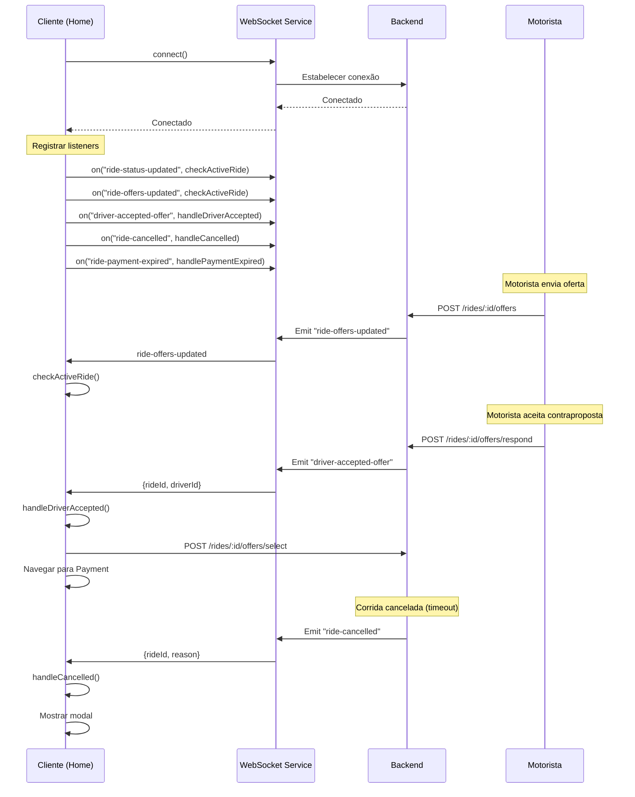

### 7.3 Implementação do Listener

```typescript
// No hook useActiveRideMonitor
webSocketService.connect().then(() => {
  // Atualiza quando status da corrida muda
  webSocketService.on("ride-status-updated", checkActiveRide);
  
  // Atualiza quando motoristas enviam ofertas
  webSocketService.on("ride-offers-updated", checkActiveRide);
  
  // Auto-seleciona oferta quando motorista aceita
  webSocketService.on("driver-accepted-offer", async (data: any) => {
    const rId = data?.rideId;
    const dId = data?.driverId;
    if (rId && dId) {
      try {
        await rideService.selectOffer(rId, dId);
        navigation.navigate("DeliveryPaymentConfirm", { rideId: rId });
      } catch (e: any) {
        navigation.navigate("RideOffersMarketplace", { rideId: rId });
      }
    }
  });
  
  // Mostra modal quando corrida é cancelada
  webSocketService.on("ride-cancelled", (data: any) => {
    const rId = data?.rideId || data?.ride?._id || data?._id;
    if (rId) setExpiredRideId(rId);
    if (navigation.isFocused()) setShowCancelledModal(true);
    // Limpa estado
    setActiveRequestingRideId(null);
    setNegotiationRideId(null);
    setWaitingQueueCount(0);
  });
  
  // Mostra modal + toast quando pagamento expira
  webSocketService.on("ride-payment-expired", (data: any) => {
    const rId = data?.rideId || data?.ride?._id || data?._id;
    if (rId) setExpiredRideId(rId);
    if (navigation.isFocused()) setShowCancelledModal(true);
    // Limpa estado
    setActiveRequestingRideId(null);
    setNegotiationRideId(null);
    setWaitingQueueCount(0);
    // Mostra toast
    Toast.show({ 
      type: "error", 
      text1: "Pagamento Expirado", 
      text2: data?.reason || "Tempo de confirmação esgotado." 
    });
  });
});
```

---

## 8. Hooks e Monitoramento <a name="hooks-monitoring"></a>

### 8.1 useActiveRideMonitor

**Responsabilidade:** Monitorar corridas ativas em tempo real

```typescript
interface ActiveRideMonitorState {
  negotiationRideId: string | null;      // ID da corrida em negociação
  activeRequestingRideId: string | null; // ID da corrida aguardando motorista
  waitingQueueCount: number;              // Corridas na fila de espera
  expiredRideId: string | null;           // ID da corrida expirada
  showCancelledModal: boolean;            // Mostrar modal de cancelamento
}
```

**Mecanismo:**
- **Polling:** `GET /rides/active/list` a cada 6 segundos
- **WebSocket:** Listeners para eventos em tempo real
- **Auto-redirect:** Quando motorista aceita → navega para RideTracking

**Lógica de Banners:**

```typescript
// Banner "Oferta Ativa"
if (activeRequestingRideId && !negotiationRideId) {
  // Mostrar banner amarelo
}

// Banner "Propostas Recebidas"
if (negotiationRideId) {
  // Mostrar banner amarelo com botão para marketplace
}

// Banner "Pedidos em Fila"
if (waitingQueueCount > 0 && !negotiationRideId && !activeRequestingRideId) {
  // Mostrar banner verde
}
```

### 8.2 useFavorites

**Responsabilidade:** Carregar e gerenciar endereços favoritos

```typescript
interface UseFavoritesReturn {
  favorites: FavoriteAddress[];
  loading: boolean;
  refresh: () => Promise<void>;
}
```

**Comportamento:**
- Carrega favoritos no mount
- Recarrega quando tela recebe foco (`useFocusEffect`)
- Tipo forte: `FavoriteAddress[]` (não `any[]`)

### 8.3 useAvailability

**Responsabilidade:** Monitorar disponibilidade de motoristas próximos

```typescript
interface UseAvailabilityReturn {
  availability: {
    rideDrivers: number;      // Motoristas de corrida
    deliveryDrivers: number;  // Motoristas de entrega
    totalNearby: number;      // Total de motoristas próximos
  };
  loading: boolean;
  error: string | null;
}
```

**Comportamento:**
- Chama `GET /rides/nearby-drivers` a cada 15 segundos
- Filtra motoristas por tipo de serviço
- Exibe badge no mapa com contagem

---

## 9. Diagrama de Navegação Completo <a name="navigation-diagram"></a>

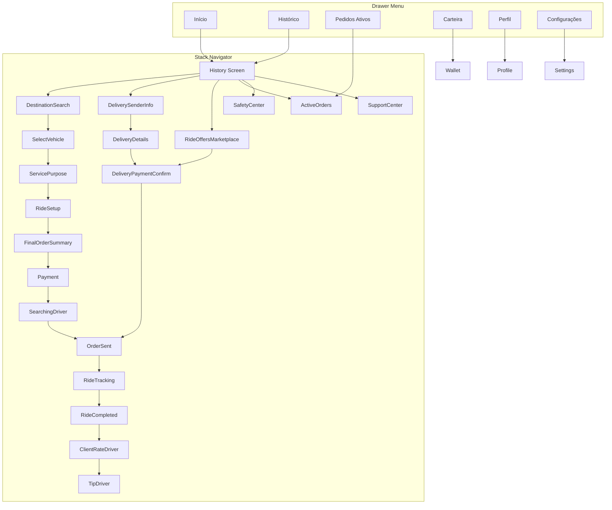

---

## 10. Resumo de Endpoints por Fluxo

### 10.1 Fluxo de Corrida

| Etapa | Método | Endpoint | Descrição |
|-------|--------|----------|-----------|
| Boot | GET | `/users/profile` | Buscar perfil do usuário |
| Boot | GET | `/rides/active` | Verificar corrida ativa |
| Home | GET | `/rides/active/list` | Listar corridas ativas (polling) |
| Home | GET | `/rides/nearby-drivers` | Motoristas próximos |
| Home | GET | `/favorite-addresses` | Listar favoritos |
| Criar | POST | `/rides/calculate-price` | Calcular preço |
| Criar | POST | `/rides` | Criar corrida |
| Negociar | GET | `/rides/:id/offers` | Listar ofertas |
| Negociar | POST | `/rides/:id/offers/respond` | Responder oferta |
| Negociar | POST | `/rides/:id/offers/select` | Selecionar motorista |
| Rastrear | GET | `/rides/:id` | Buscar detalhes da corrida |
| Cancelar | POST | `/rides/:id/cancel` | Cancelar corrida |
| Avaliar | POST | `/rides/:id/rate-client` | Avaliar motorista |
| Gorjeta | POST | `/rides/:id/tip` | Adicionar gorjeta |

### 10.2 Fluxo de Entrega

| Etapa | Método | Endpoint | Descrição |
|-------|--------|----------|-----------|
| Calcular | POST | `/rides/calculate-price` | Calcular preço da entrega |
| Criar | POST | `/rides` | Criar entrega (serviceType: "delivery") |
| Rastrear | GET | `/rides/:id` | Buscar detalhes da entrega |
| Status | PATCH | `/rides/:id/status` | Atualizar status (motorista) |

---

## 📚 Referências

- **Tipos de Navegação:** `src/screens/(authenticated)/Client/types/navigation.ts`
- **Serviço de Corridas:** `src/services/ride.service.ts`
- **Serviço de Favoritos:** `src/services/favoriteAddress.service.ts`
- **Hook de Monitoramento:** `src/screens/(authenticated)/Client/Shared/hooks/useActiveRideMonitor.ts`
- **Documentação da Home:** `docs/27-home-screen-client-analysis.md`

---

## 📝 Changelog

| Data | Versão | Mudanças |
|------|--------|----------|
| 2026-05-26 | 1.0 | Documentação inicial com fluxogramas completos |

---

**Próxima revisão:** Após implementação do modo Pay (carteira)
