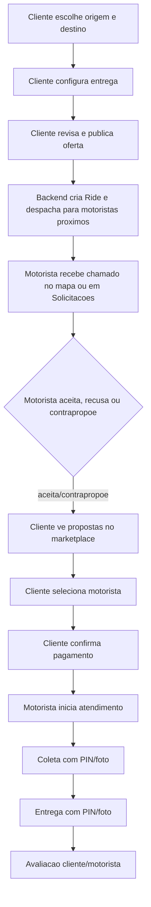

# Plano do fluxo cliente -> motorista em entregas

Data da auditoria: 2026-06-05

## Escopo

Este documento mapeia o fluxo em que o cliente pede uma entrega e o motorista recebe o chamado, incluindo o que ja esta implementado, o que parece funcional e o que falta corrigir antes de homologar.

Foram analisados tres ramos:

- Entrega avulsa negociada no app.
- Tracking, coleta, entrega e avaliacao.
- Fase D: rotas planejadas, maloteiro e frete sob demanda por transportadora.

## Fluxo principal esperado

## Estado atual resumido

O fluxo existe em codigo e tem boa parte das telas montadas. O cliente consegue configurar entrega, revisar, publicar, acompanhar propostas, cancelar e acompanhar tracking. O motorista consegue ficar online, receber chamado por websocket ou por polling, aceitar, recusar, negociar e operar uma entrega ativa.

O principal bloqueio para considerar o fluxo pronto esta na etapa de selecao de proposta e pagamento: a tela do cliente seleciona a oferta e navega direto para tracking, enquanto o backend marca a corrida como `driver_assigned`. A tela de confirmacao de pagamento espera `payment_pending`, e o endpoint de confirmacao tambem exige `payment_pending`. Resultado: a etapa de pagamento negociado existe, mas esta desalinhada.

Tambem ha pendencias de qualidade importantes: textos com mojibake em telas criticas, prova fotografica nao obrigatoria na coleta/entrega e divergencia no `sourceType="freight"` da fase D.

## Telas do cliente

| Tela | Arquivo | Estado | Observacao |
|---|---|---|---|
| Home / busca de destino | `src/screens/(authenticated)/Client/Home`, `DestinationSearch` | Parcialmente auditado | Rotas existem no stack; entrada exata do fluxo precisa de teste manual. |
| Configurar entrega | `src/screens/(authenticated)/Client/Ride/Request/DeliverySetup/index.tsx` | Implementada | Calcula preco, valida rota, oferta, recebedor, tipo de carga, peso, prioridade e agenda sugerida. |
| Revisar entrega | `src/screens/(authenticated)/Client/Ride/Request/DeliveryReview/index.tsx` | Funcional com pendencia visual | Monta `CreateRideRequest`, envia `serviceType: "delivery"` e cria negociacao. Tem muitos textos corrompidos. |
| Pedido enviado | `src/screens/(authenticated)/Client/Ride/OrderSentScreen/index.tsx` | Implementada | Mostra confirmacao e volta para Home apos 5s. Textos com mojibake. |
| Pedidos ativos | `src/screens/(authenticated)/Client/Orders/ActiveOrders/index.tsx` | Implementada | Decide se abre marketplace, tracking, conclusao ou detalhe. Tem textos corrompidos em alguns pontos. |
| Marketplace de propostas | `src/screens/(authenticated)/Client/Orders/RideOffersMarketplaceScreen.tsx` | Parcial | Lista ofertas, recomenda, contrapropoe, aumenta oferta, recusa oferta e cancela. Ponto critico: `handleSelectOffer` navega direto para `DeliveryTracking`. |
| Confirmar pagamento | `src/screens/(authenticated)/Client/Ride/Request/DeliveryPaymentConfirm/index.tsx` | Implementada, mas desalinhada | Tela tem timer, metodo de pagamento e confirmacao. Hoje fica praticamente fora do fluxo correto porque o backend nao deixa a corrida em `payment_pending`. |
| Tracking de entrega | `src/screens/(authenticated)/Client/Ride/Tracking/DeliveryTracking/index.tsx` | Implementada | Busca ride, acompanha motorista, chat, rota auditada e redireciona para avaliacao quando completa. |
| Avaliacao / conclusao | `RideCompleted`, `RateDriver` | Implementada segundo historico e rotas | Ja houve ajuste anterior para persistir avaliacao; precisa so de smoke no fluxo completo atual. |
| Fretes / Transportadoras | `src/screens/(authenticated)/Client/Routes/FreightScreen.tsx` | Parcial | Solicita frete, aceita cotacao, acompanha e abre disputa. Nao coleta coordenadas, entao o Ride pode cair em lat/lng `0`. |
| Rotas planejadas | `PlannedRoutesScreen`, `RouteReserveScreen` | Implementada com pendencias | Descobre/reserva rotas e acompanha se houver `rideId`. Textos ainda corrompidos. |

## Telas do motorista

| Tela | Arquivo | Estado | Observacao |
|---|---|---|---|
| Mapa do motorista | `src/screens/(authenticated)/Driver/DriverHomeScreen.tsx` | Implementada | Online/offline, serviceTypes, websocket `new-ride-request`, alerta sonoro, bottom sheet e fallback por sincronizacao. Tem textos/comentarios corrompidos. |
| Solicitacoes | `src/screens/(authenticated)/Driver/DriverRequestsScreen.tsx` | Implementada | Lista chamadas, negociacoes pendentes e agendadas; aceita, recusa e contrapropoe. Tem polling de 6s. Textos corrompidos. |
| Oferta de entrega | `src/screens/(authenticated)/Driver/DeliveryOfferScreen.tsx` | Implementada | Tela dedicada com mapa, contador, aceitar e contrapropor. Tem texto corrompido. |
| Negociacao motorista | `src/screens/(authenticated)/Driver/DriverNegotiationScreen.tsx` | Implementada | Permite propor novo valor e acompanhar oferta. Precisa limpeza de copy. |
| Corrida/entrega ativa | `src/screens/(authenticated)/Driver/DriverRideScreen.tsx` | Implementada com pendencias de prova | Atualiza status, tracking, chat, cancelamento, chegada no destino e conclusao. Possui helper de camera, mas nao envia foto obrigatoria. |
| Confirmar coleta | `src/screens/(authenticated)/Driver/DeliveryPickupConfirm/index.tsx` | Parcial | Valida PIN automaticamente usando o PIN que o proprio app mostra ao motorista; nao exige foto. |
| Confirmar entrega | `src/screens/(authenticated)/Driver/DeliveryDropoffConfirm/index.tsx` | Parcial | Pede PIN do destinatario e conclui. Nao exige foto. |
| Fretes recebidos | `src/screens/(authenticated)/Driver/CarrierFreightScreen.tsx` | Parcial | Transportadora cota, recusa, confirma coleta e entrega. Usa fluxo simplificado sem PIN/foto na tela. |
| Minhas rotas / detalhe | `DriverRoutesScreen`, `DriverRouteDetailScreen` | Implementada com pendencias | Rotas planejadas tem UI de PIN/foto na reserva, mas ainda precisa teste E2E com `Ride` vinculado. |

## Backend e contratos

| Area | Arquivo | Estado | Observacao |
|---|---|---|---|
| Criacao e despacho de entrega | `backend/src/controllers/ride.controller.js` | Implementado | `create` salva `Ride`, pre-seleciona pagamento quando informado e despacha para motoristas proximos. |
| Aceite direto | `ride.controller.js` | Implementado | `accept` valida saldo, localizacao, servico ativo, veiculo e concorrencia. |
| Marketplace de ofertas | `ride.controller.js`, `ride.routes.js` | Implementado | `listOffers`, `submitOfferResponse`, `clientCounterOffer`, `selectOffer`, `declineOffer`, `increaseOffer`. |
| Pagamento negociado | `confirmNegotiationPayment`, `cancelPaymentSelection` | Parcial | Endpoints existem, mas o estado `payment_pending` nao e ativado corretamente na selecao da oferta. |
| Timeout de pagamento | `schedulePaymentPendingTimeout` | Pendente de ligacao | Funcao existe, mas nao foi encontrada chamada que a ative apos selecionar oferta. |
| Status da entrega | `updateStatus` | Implementado | Controla `driver_arriving`, `arrived`, `in_progress`, `completed` e `arrivedAtDropoff`. |
| PIN | `validatePin`, `updateStatus` | Implementado | Backend registra tentativas e validacao. Uso de coleta esta fraco no app porque o motorista ja recebe o PIN automaticamente. |
| Prova fotografica | `ride.ratingProof.mixin.js` | Parcial | Endpoints existem (`proof/pickup`, `proof/delivery`), mas nao estao exigidos no app principal. |
| Falha de entrega | `reportDeliveryFailure` | Implementado no backend | Registra `delivery_failed`, liquida devolucao e notifica cliente; precisa tela/fluxo mais claro no app. |
| Frete sob demanda | `freight.controller.js`, `FreightRequest` | Parcial | Cria `Ride` ao aceitar cotacao, mas usa `sourceType: "freight"` fora do enum atual de `Ride`. |
| Rotas planejadas | `driverRoute.controller.js`, `RouteReservation` | Implementado com pendencias | Publica rota, reserva, aceita, coleta, entrega e usa escrow. Precisa validar o fluxo com `Ride`/tracking/PIN/foto. |

## Pendencias criticas

### P0 - Corrigir antes de homologar

1. Corrigir handoff de proposta selecionada para pagamento.
   - Hoje: `RideOffersMarketplaceScreen.handleSelectOffer` chama `selectOffer` e navega para `DeliveryTracking`.
   - Hoje no backend: `selectOffer` seta `ride.status = "driver_assigned"`.
   - Esperado: `selectOffer` deve setar `payment_pending`, guardar `selectedDriverId` e `finalAgreedPrice`, iniciar timeout de 5 min e navegar para `DeliveryPaymentConfirm`.
   - Depois: `confirmNegotiationPayment` muda para `driver_assigned` ou `accepted` conforme regra operacional e notifica o motorista.

2. Ligar timeout real de pagamento.
   - `DeliveryPaymentConfirm` mostra expiracao, mas ao expirar apenas navega para Home.
   - Backend tem `cancelPaymentSelection` e `schedulePaymentPendingTimeout`, mas a selecao nao ativa esse ciclo.
   - Esperado: expirar no backend e liberar motorista; no app, chamar cancelamento ou reagir ao evento do backend.

3. Corrigir contrato `sourceType` para frete sob demanda.
   - `freight.controller.js` cria `Ride` com `sourceType: "freight"`.
   - `Ride.js` tem enum apenas `app`, `marketplace`, `planned_route`.
   - O mesmo `Ride.js` tem hook para `sourceType === "freight"`, entao a intencao existe, mas o schema bloqueia.

4. Remover mojibake das telas do fluxo.
   - Exemplos: `Análise`, `Cotação`, `Você`, `Próximo`, icones quebrados.
   - Afeta cliente e motorista em telas centrais.

### P1 - Necessario para fluxo profissional

5. Exigir prova fotografica na coleta e entrega.
   - Backend ja tem endpoints de foto.
   - `DriverRideScreen` tem helper de camera, mas nao chama `uploadPickupProof`/`uploadDeliveryProof`.
   - `DeliveryPickupConfirm` e `DeliveryDropoffConfirm` nao exigem foto.

6. Reforcar PIN de coleta.
   - Hoje a coleta valida automaticamente o PIN que esta no proprio objeto da entrega.
   - Esperado: PIN informado pelo remetente/estabelecimento, sem o motorista conseguir confirmar so lendo o valor salvo.

7. Coletar coordenadas reais no frete sob demanda.
   - `FreightScreen` envia apenas endereco texto.
   - `freight.controller.js` cria `Ride` com latitude/longitude `0` quando nao ha coordenadas.
   - Isso quebra mapa, distancia e tracking.

8. Validar todos os ramos de cancelamento.
   - Cliente cancela antes de motorista.
   - Cliente cancela apos proposta selecionada.
   - Motorista cancela antes de iniciar e redespacho acontece.
   - Timeout sem motorista.
   - Timeout de pagamento.

9. Testar agendados e fila de espera.
   - Existem `scheduled`, `promoteToScheduled`, `acceptScheduled`, fila e aumento de oferta.
   - Precisa provar com casos reais porque ha muitas condicoes de status.

### P2 - Evolucao

10. Unificar copy e nomes de servico.
    - Evitar chamar entrega de corrida em telas, toasts e erros.
    - Usar `serviceType` para copy dinamica.

11. Padronizar tracking entre entrega avulsa, frete e rota planejada.
    - Todos deveriam reutilizar `DeliveryTracking`, PIN, foto, disputa e historico.

12. Criar checklist de smoke manual.
    - Cliente publica entrega.
    - Motorista recebe chamado.
    - Motorista aceita/contrapropoe.
    - Cliente seleciona proposta.
    - Cliente confirma pagamento.
    - Motorista coleta com PIN/foto.
    - Motorista entrega com PIN/foto.
    - Cliente avalia motorista.
    - Motorista avalia cliente.

## Plano de correcao sugerido

### Fase 1 - Desbloquear entrega avulsa

- Ajustar `selectOffer` para `payment_pending`.
- Fazer `RideOffersMarketplaceScreen` navegar para `DeliveryPaymentConfirm`.
- Ativar timeout backend de pagamento.
- Fazer expiracao chamar/liberar via `cancelPaymentSelection`.
- Smoke do fluxo cliente -> motorista -> pagamento -> tracking.

### Fase 2 - Segurança operacional

- Conectar foto de coleta e entrega nos endpoints existentes.
- Alterar PIN de coleta para entrada manual.
- Impedir `completed` sem entrega validada por PIN/foto quando `serviceType === "delivery"`.
- Testar `delivery_failed` e devolucao.

### Fase 3 - Qualidade de tela

- Limpar mojibake em todas as telas listadas.
- Revisar toasts para mostrar `error`/`message` reais do backend.
- Corrigir copy de entrega/corrida por `serviceType`.

### Fase 4 - Fase D

- Corrigir enum `Ride.sourceType` incluindo `freight`.
- Coletar coordenadas no `FreightScreen`.
- Garantir que frete e rotas planejadas usem o mesmo tracking/PIN/foto da entrega avulsa.
- Validar escrow/release/refund em frete e reservas de rota.

## Evidencias de arquivos analisados

- `src/routes/client.stack.routes.tsx`
- `src/routes/drawer.driver.routes.tsx`
- `src/services/ride.service.ts`
- `src/services/freight.service.ts`
- `src/screens/(authenticated)/Client/Ride/Request/DeliverySetup/index.tsx`
- `src/screens/(authenticated)/Client/Ride/Request/DeliveryReview/index.tsx`
- `src/screens/(authenticated)/Client/Orders/RideOffersMarketplaceScreen.tsx`
- `src/screens/(authenticated)/Client/Ride/Request/DeliveryPaymentConfirm/index.tsx`
- `src/screens/(authenticated)/Client/Ride/Tracking/DeliveryTracking/index.tsx`
- `src/screens/(authenticated)/Client/Orders/ActiveOrders/index.tsx`
- `src/screens/(authenticated)/Client/Routes/FreightScreen.tsx`
- `src/screens/(authenticated)/Client/Routes/PlannedRoutesScreen.tsx`
- `src/screens/(authenticated)/Driver/DriverHomeScreen.tsx`
- `src/screens/(authenticated)/Driver/DriverRequestsScreen.tsx`
- `src/screens/(authenticated)/Driver/DeliveryOfferScreen.tsx`
- `src/screens/(authenticated)/Driver/DriverNegotiationScreen.tsx`
- `src/screens/(authenticated)/Driver/DriverRideScreen.tsx`
- `src/screens/(authenticated)/Driver/DeliveryPickupConfirm/index.tsx`
- `src/screens/(authenticated)/Driver/DeliveryDropoffConfirm/index.tsx`
- `src/screens/(authenticated)/Driver/CarrierFreightScreen.tsx`
- `src/screens/(authenticated)/Driver/DriverRouteDetailScreen.tsx`
- `backend/src/routes/ride.routes.js`
- `backend/src/routes/freight.routes.js`
- `backend/src/controllers/ride.controller.js`
- `backend/src/controllers/ride.ratingProof.mixin.js`
- `backend/src/controllers/freight.controller.js`
- `backend/src/controllers/driverRoute.controller.js`
- `backend/src/models/Ride.js`

